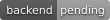
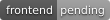
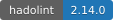
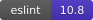
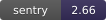

# My Site

[🇷🇺 Russian version](./README_RU.md)

| Category | Technologies |
|----------|--------------|
| Coverage |   |
| Backend |          |
| Database |    |
| Cache |  |
| Frontend |    |
| Testing |    |
| DevOps |     |
| Quality |           |
| Logging |    |
| Architecture |   |
| Tools |     |
| CI/CD |   |

> [!NOTE]
> Backend coverage — pytest (Python). Frontend coverage — Jest (TypeScript). Both generated in separate CI jobs.

## 📖 Documentation

## 📂 Project Structure

## ✨ Features

## 🚀 Quick Start

1. Clone the repository:
```bash
git clone git@github.com:ALittleMoron/my-site.git
cd my-site
```

2. Create `.env` file:
```bash
cp .env.example .env
```

3. Create certs for `nginx` (optional for local development):

The nginx container runs as UID/GID `101:101`, so mounted certificate and private key files must be
readable by that user. For local `mkcert` files,
`chmod 644 ./infra/nginx/certs/<file>` is enough; for production, prefer owner/group permissions
that grant read access only to nginx.
Production Let's Encrypt issuance and renewal are handled through the compose-backed
`make certbot-issue`, `make certbot-renew`, and `make certbot-sync` targets. See
[Production Deploy](../docs/production-deploy.md).

4. Update `.env` with your values.

5. Run via `Makefile`:
```bash
make run
```

## Local MCP bridge

## ⚙️ Endpoints

Local edge nginx redirects HTTP to HTTPS, so use the HTTPS URLs in the browser.

- Frontend: `https://localhost`
- API: `https://localhost/api`
- API liveness: `https://localhost/api/healthcheck`
- API readiness: `https://localhost/api/healthcheck/ready`
- API docs: `https://localhost/api/docs`
- OpenAPI spec: `https://localhost/api/docs/openapi.json`

Internal web panels are available only through host-level WireGuard and nginx
ports bound to `VPN_BIND_ADDRESS`:

The production public firewall baseline is `80/tcp`, `443/tcp`, and the chosen
WireGuard UDP port. See [WireGuard internal access](../docs/wireguard-internal-access.md).

See [docker-compose.yml](../docker-compose.yml) for all services.

## 🧪 Tests

Backend pytest targets run with an explicit pytest-xdist worker count based on physical CPU cores,
not `-n auto`. Set `BACKEND_PYTEST_WORKERS=0` or `1` for serial execution, or set any value greater
than `1` to force that exact worker count. Unit tests run without a test database; integration tests
clone a migrated run-scoped template into isolated per-worker PostgreSQL databases, while Alembic
migration tests stay serial against the base test database.
